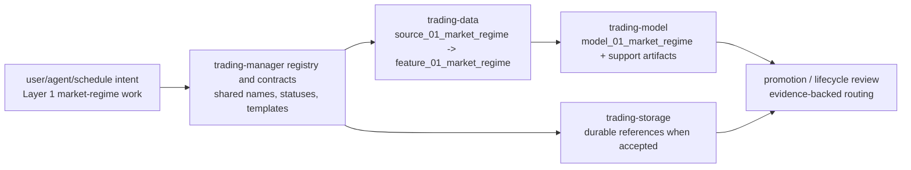

# Layer 01 - Market Regime

This file records the `trading-manager` control-plane and naming view of Layer 1. Component-local construction details remain in `trading-data`, `trading-model`, and `trading-storage`.

## Artifact chain

Canonical Layer 1 artifacts are:

```text
trading_data.source_01_market_regime
trading_data.feature_01_market_regime
trading_model.model_01_market_regime
trading_model.model_01_market_regime_explainability
trading_model.model_01_market_regime_diagnostics
```

`source` and `feature` belong to `trading-data`; `model`, `model_explainability`, and `model_diagnostics` belong to `trading-model`; physical storage contracts belong to `trading-storage` when accepted.

## Naming rule

Layer-owned output fields use compact numeric prefixes everywhere they are the reviewed canonical name:

```text
1_price_behavior_factor
1_transition_pressure
1_data_quality_score
```

Do not create semantic aliases such as `layer01_price_behavior_factor` for physical SQL columns. If SQL needs quoting because a column starts with a digit, quote the compact canonical name instead of inventing a second name.

Generic identity, lineage, and timestamp fields do not need a layer prefix, for example `available_time`, `model_id`, `model_version`, and receipt/run metadata.

## Control-plane boundary

`trading-manager` may route Layer 1 jobs and registry names, but it does not construct market-regime data or model rows.

Layer 1 must remain broad-market only. It must not route or register Layer 1 outputs that imply sector rotation, selected sectors, selected securities, strategy choice, option contract choice, or portfolio action.

## Registry duty

New shared fields, statuses, reason-code vocabularies, artifact names, or helper surfaces discovered while working on Layer 1 require reviewed registry migrations before other repositories hard-depend on them. Documentation-only clarification does not by itself require a registry migration.

## Stage flow



## Layer acceptance

Layer 1 manager changes are acceptable when they:

- keep `trading-manager` at the control-plane, registry, contract, template, and lifecycle boundary;
- avoid introducing component runtime trading code, market data, generated artifacts, notebooks, credentials, or secrets;
- preserve broad-market-only Layer 1 naming and reject sector/security/strategy/option/portfolio leakage;
- update registry migrations and regenerate `scripts/registry/current.csv` when shared names, statuses, fields, or artifact paths change;
- keep component-specific implementation detail in the owning component repository.

Current verification:

```bash
git status --short
find docs -maxdepth 1 -type f | sort
find . -maxdepth 2 -type f | sort
PYTHONPATH=src python3 -m unittest discover -s tests -v
git diff --check
```
