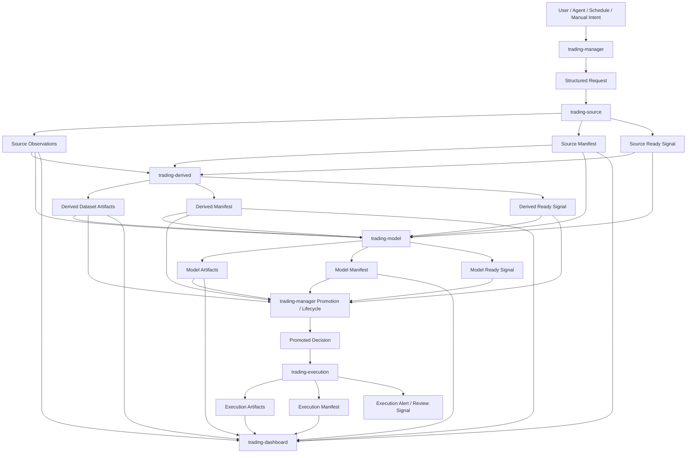

# Workflow

## Purpose

This file defines the cross-repository collaboration workflow for the trading system.

It describes how work moves between component repositories, how repositories hand off evidence to one another, and how the system avoids hidden coupling.

Component-internal workflows belong in each component repository's own `docs/02_workflow.md`.

## Collaboration Layers

The trading system collaboration model has these layers:

1. **Intent and control**
   - `trading-manager` receives user, Agent, schedule, recovery, or manual intent.
   - It turns intent into structured cross-repository requests.

2. **Source-data production**
   - `trading-source` receives source-data requests and produces external/source-backed observations, manifests, and ready signals.

3. **Shared persistence**
   - `trading-storage` defines how persistent outputs are laid out, retained, archived, restored, and referenced.
   - Other repositories use storage contracts rather than inventing local path rules.

4. **Derived-data generation**
   - `trading-derived` consumes source observations and produces internally generated labels, samples, signals, candidates, oracle outcomes, backtest/evaluation outputs, manifests, and ready signals.

5. **Model research**
   - `trading-model` consumes the `trading-source` + `trading-derived` dataset foundation.
   - It produces state tables, training/evaluation outputs, mappings, verdicts, manifests, and ready signals.

6. **Promotion and lifecycle**
   - `trading-manager` consumes manifests and ready signals.
   - It decides whether outputs should be reviewed, promoted, retried, archived, rehydrated, or routed downstream.

7. **Execution**
   - `trading-execution` consumes externally promoted strategy/model/target decisions.
   - It produces execution artifacts, manifests, alerts, and review outputs.

8. **Dashboard consumption**
   - `trading-dashboard` consumes already-produced artifacts, manifests, and signals.
   - It visualizes existing truth; it does not create strategy, model, data, or execution truth.

## Cross-Repository Operating Principles

- Repositories communicate through structured requests, artifact references, manifests, and ready signals.
- A repository should not depend on another repository's internal implementation details.
- A repository should not directly mutate another repository's local state.
- Cross-repository requests must identify the target repository, requested workflow, parameters, input references, expected outputs, and idempotency expectations.
- Manifests provide run evidence.
- Ready signals provide downstream consumability markers.
- Artifact references provide stable handoff points.
- Shared statuses and registrable fields are maintained in `trading-main/scripts/`; registry operating rules are in `docs/08_registry.md`.
- `trading-main` defines global collaboration contracts but does not execute workflows.
- Component-local workflow detail belongs in the owning component repository.
- Execution consumes promoted decisions only; it must not generate derived datasets or train models.
- Dashboard consumes existing outputs only; it must not recompute upstream truth.

## Primary Collaboration Flow



## Handoff Pattern

Every cross-repository handoff should follow this pattern:

```text
request -> run -> artifact(s) -> manifest -> ready signal -> downstream consumption or manager review
```

Where:

- **request** records the intended work;
- **run** is owned internally by the target component repository;
- **artifact(s)** are durable outputs;
- **manifest** records what happened and what was produced;
- **ready signal** marks whether downstream consumers may use the outputs;
- **manager review or downstream consumption** advances the system lifecycle.

## Manager Collaboration Role

`trading-manager` coordinates system progress by:

- creating structured requests;
- checking dependency readiness;
- observing manifests and ready signals;
- deciding retry, recovery, promotion, archive, rehydrate, and review paths;
- routing promoted decisions to execution;
- avoiding component-internal implementation control.

The manager should not become a hidden implementation layer for source fetching, derived-data generation, modeling, execution, or dashboard rendering.

## Storage Collaboration Role

`trading-storage` provides shared persistence rules used by other repositories.

Other repositories may write and read storage-backed outputs according to storage and artifact contracts, but they should not invent incompatible local layouts for system-level artifacts.

`trading-main` may define system-level artifact expectations, while `trading-storage` owns concrete persistent storage rules.

## Model Contamination Boundary

The model collaboration flow has one hard sequencing rule:

```text
source observations -> market-only features -> market-state discovery -> state table
derived strategy/evaluation outputs -> attach after state table exists -> state evaluation -> winner mapping
```

Strategy returns, backtest results, oracle outcomes, or other generated derived outputs must not be used to discover market states.

This rule is system-level because violating it invalidates the interpretation of downstream strategy-selection and training evidence.

## Execution Collaboration Boundary

`trading-execution` may consume promoted decisions from upstream systems.

It must not:

- train models;
- run derived-data generators or strategy backtests;
- choose active strategy variants by itself;
- make cross-repository promotion decisions;
- bypass manager-controlled lifecycle policy.

## Dashboard Collaboration Boundary

`trading-dashboard` may consume artifacts, manifests, and ready signals from upstream repositories.

It must not:

- fetch market data as a source of truth;
- run derived-data generators or strategy backtests;
- train models;
- execute trades;
- silently recompute or overwrite upstream outputs.

## Open Gaps

The following collaboration details still need definition before implementation depends on them:

- exact request contract fields;
- exact artifact reference format;
- exact manifest schema;
- exact ready-signal schema;
- exact shared storage root;
- exact registered status vocabulary and field names in `trading-main/scripts/`, governed by `docs/08_registry.md`;
- exact shared environment runtime version and dependency policy.
