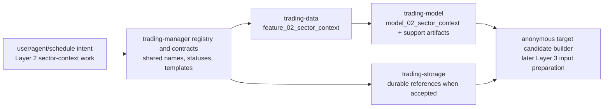

# Layer 02 - Sector Context

This file records the `trading-manager` control-plane and naming view of Layer 2. Component-local construction details remain in `trading-data`, `trading-model`, and `trading-storage`.

## Artifact chain

Canonical Layer 2 artifacts are:

```text
trading_data.feature_02_sector_context
trading_model.model_02_sector_context
trading_model.model_02_sector_context_explainability
trading_model.model_02_sector_context_diagnostics
```

Layer 2 currently has a deterministic feature surface rather than a separate `source_02_sector_context` table. `source_02_target_candidate_holdings` is downstream candidate-builder / Layer 3 input-preparation evidence, not Layer 2 core behavior input.

## Naming rule

Layer-owned output fields use compact numeric prefixes everywhere they are the reviewed canonical name:

```text
2_trend_stability_score
2_sector_handoff_state
2_state_quality_score
```

Do not create semantic aliases such as `layer02_trend_stability_score` for physical SQL columns. If SQL needs quoting because a column starts with a digit, quote the compact canonical name instead of inventing a second name.

Generic identity, lineage, and timestamp fields do not need a layer prefix, for example `available_time`, `sector_or_industry_symbol`, `model_id`, `model_version`, and receipt/run metadata.

## Control-plane boundary

Layer 2 may hand off selected, watched, blocked, or insufficient-data sector/industry baskets for downstream anonymous target construction. It must not select final stocks, strategies, option contracts, position sizes, or portfolio actions.

Allowed handoff states are:

```text
selected | watch | blocked | insufficient_data
```

## Registry duty

New shared fields, statuses, reason-code vocabularies, artifact names, or helper surfaces discovered while working on Layer 2 require reviewed registry migrations before other repositories hard-depend on them. Documentation-only clarification does not by itself require a registry migration.

## Stage flow



## Layer acceptance

Layer 2 manager changes are acceptable when they:

- keep `trading-manager` at the control-plane, registry, contract, template, and lifecycle boundary;
- avoid introducing component runtime trading code, market data, generated artifacts, notebooks, credentials, or secrets;
- keep Layer 2 scoped to sector/industry context and handoff state, not final stocks, strategies, option contracts, position sizing, or portfolio actions;
- update registry migrations and regenerate `scripts/registry/current.csv` when shared names, statuses, fields, or artifact paths change;
- keep component-specific implementation detail in the owning component repository.

Current verification:

```bash
git status --short
find docs -maxdepth 1 -type f | sort
find . -maxdepth 2 -type f | sort
PYTHONPATH=src python3 -m unittest discover -s tests -v
git diff --check
```
